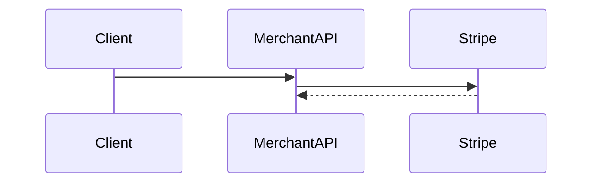

# Integration surface — one-pager template

Copy this file per surface (checkout, billing, Connect transfers, webhooks, etc.).

## Surface name

_e.g. Subscription checkout with metered usage_

## Inputs

- Who calls what (merchant backend, browser, mobile)?
- Auth model (API key, Connect header, OAuth)?

## Outputs

- Stripe objects created/updated:
- Webhooks emitted:

## Sequence (sketch)

## Failure modes

| Failure | User impact | Detection | Mitigation |
|---------|-------------|-----------|------------|
| | | | |

## Stripe docs

- Primary:
- Edge cases:

## Test mode rehearsal

| Step | Test object ID | Date |
|------|----------------|------|
| | | |

## Open questions

-
